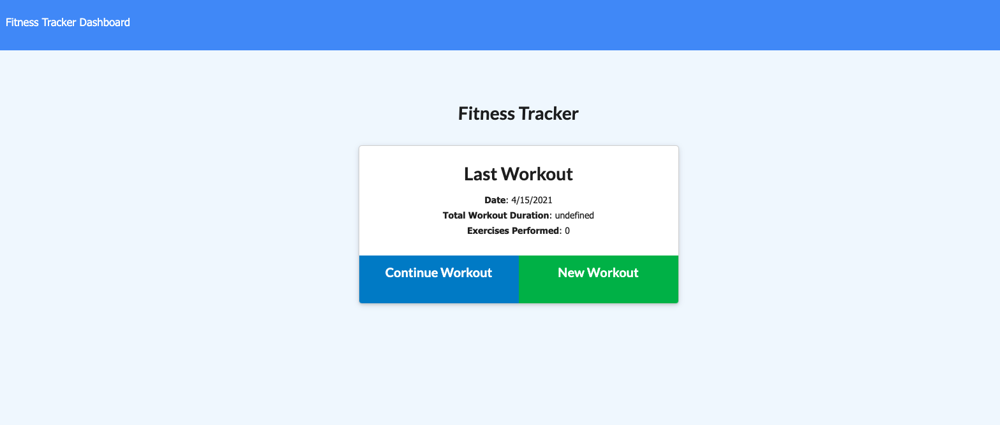
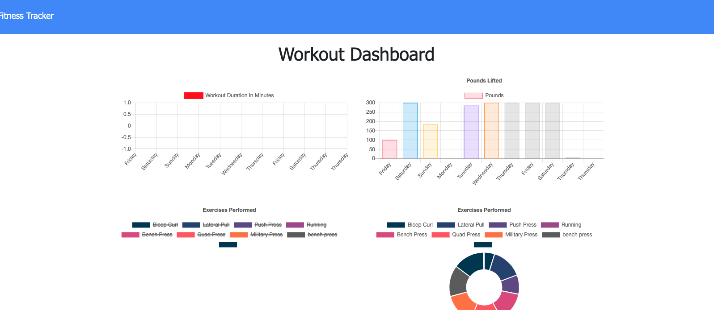
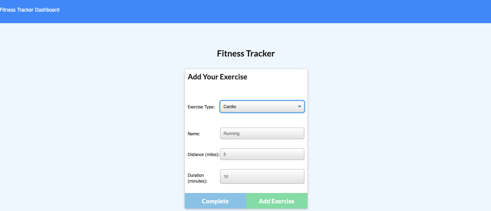

# workout-tracker-03

  
 
 

 

  # Description
   As a user, I want to be able to view create and track daily workouts. I want to be able to log multiple exercises in a workout on a given day. I should also be able to track the name, type, weight, sets, reps, and duration of exercise. If the exercise is a cardio exercise, I should be able to track my distance traveled.

  
  # Table of Contents 
  * [Installation](#installation)
  * [Usage](#usage)
  * [License](#license)
  * [Contributing](#contributing)
  * [Tests](#tests)
  * [Questions](#questions)
  
  
  # Installation
  The following necessary dependencies must be installed to run the application properly: 

  Clone repo to git command
  
  Npm Install

  Npm start
  
  # License
  This project is license under the MIT license.
  
  
 
 
  # Questions
  If you have any questions about the repo, open an issue or contact undefined directly .

  malcantar185@gmail.com

  malcan09@GitHub